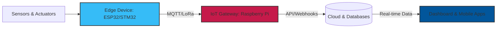

  

###

 
   

<h1 align="center">
  
</h1>

  

---

### 🚀 About Me
- 🔭 I’m currently working on advanced **IoT Systems** and **Embedded Solutions**.
- 🌱 I’m currently learning **LoRaWAN, FreeRTOS, and Industrial IoT (IIoT)**.
- 🎓 Studying **IoT Engineering** at King Mongkut's Institute of Technology Ladkrabang (IOTE).
- 🌐 Explore my portfolio: [tems2548.github.io](https://tems2548.github.io)
- ⚡ Fun fact: I love building things that bridge the gap between hardware and software.

---

### ⚙️ IoT Ecosystem

---

### 📈 Activity Graph

  

---

### 🛠️ Languages & Tools

<table align="center">
  <tr>
    <td align="center" width="50%">
      <strong>💻 Software</strong>  
      
    </td>
    <td align="center" width="50%">
      <strong>🔌 Hardware</strong>  
      
    </td>
  </tr>
</table>

---

### 📊 My GitHub Stats

  
  

  

---

### 📫 Connect with me

  
  
  
  
  

  

  

